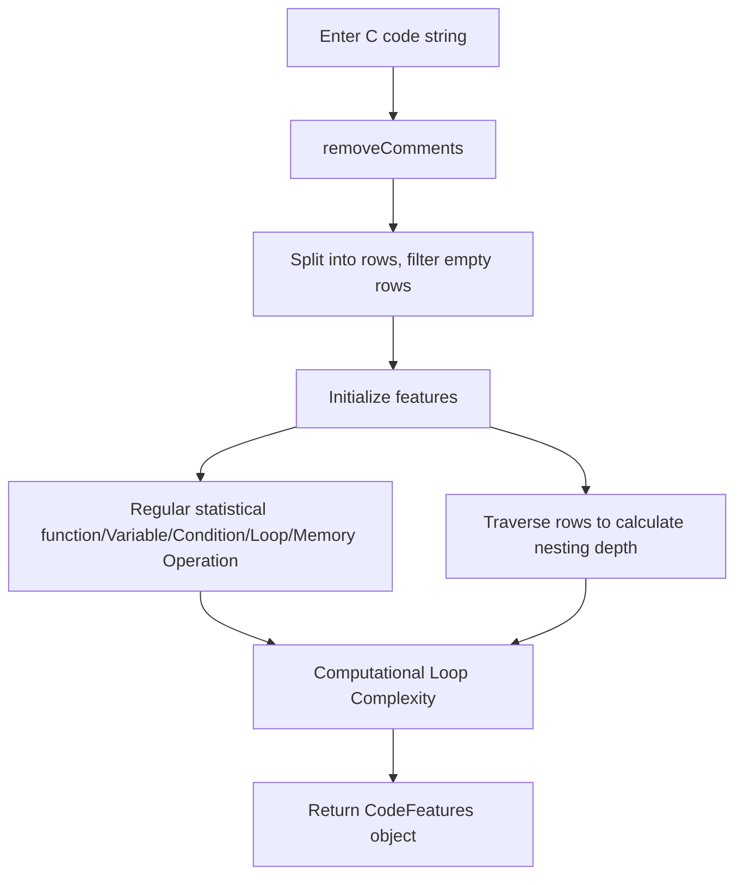

用于介绍机器学习算法中的相关模块

### Analyser

- 用于提取输入程序中的特征：

#### mermaid

网站的渲染结果：

#### 特征分析

1. **loc**  
   代码有效行数（Lines of Code），即去除注释和空行后实际的代码行数。

2. **num_functions**  
   函数数量，统计 C 代码中定义的函数总数。

3. **nesting_depth**  
   最大循环嵌套深度，表示代码中循环结构（如 for、while、do）嵌套的最大层数。

4. **num_conditional_statements**  
   条件语句数量，统计 if、else if、else、switch 等条件判断语句的总数。

5. **num_variables**  
   变量声明数量，统计代码中声明的变量总数（如 int、char、float、double 类型的变量）。

6. **function_call_count**  
   函数调用次数，统计代码中实际调用函数的次数（不包括函数定义本身）。

7. **cyclomatic_complexity**  
   圈复杂度（Cyclomatic Complexity），衡量代码逻辑复杂度的指标，初始值为 1，每出现一个条件语句或增加一层循环嵌套则加一。

8. **memory_operations**  
   内存操作次数，统计代码中出现的内存分配与释放操作的次数（如 malloc、calloc、realloc、free）。        

### FDMT-KNN

Feature-driven Multi-target KNN Parameter Prediction

